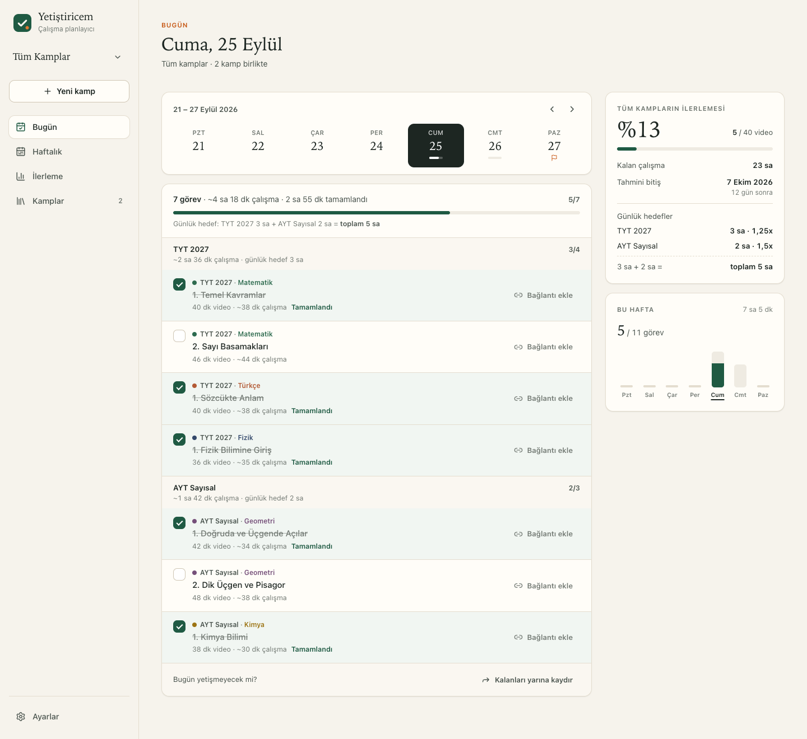
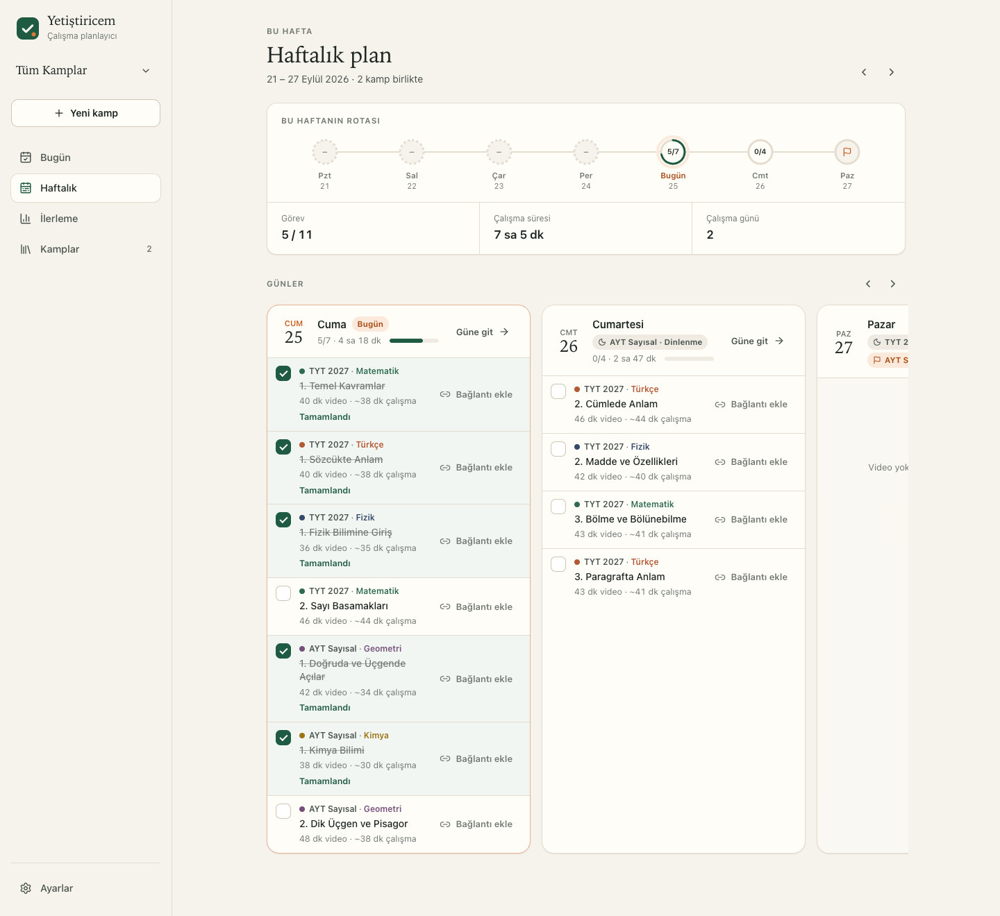
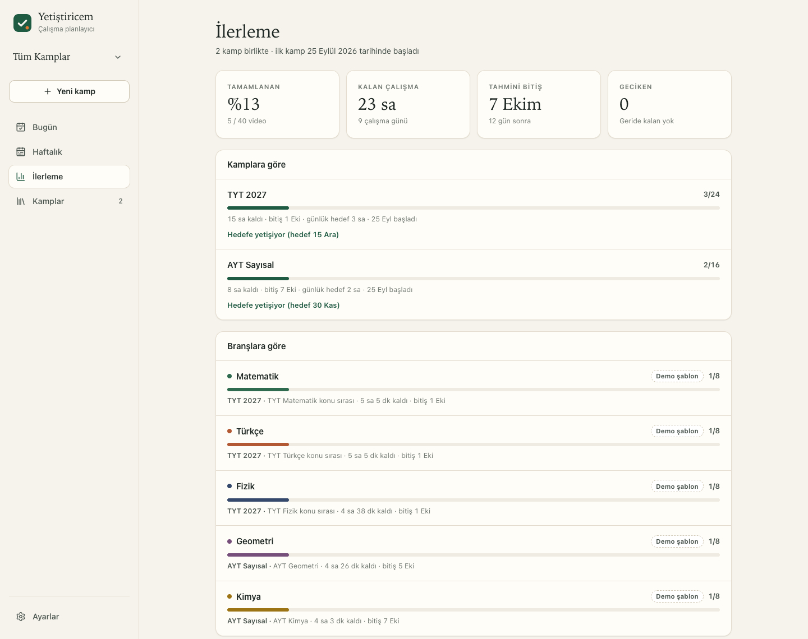
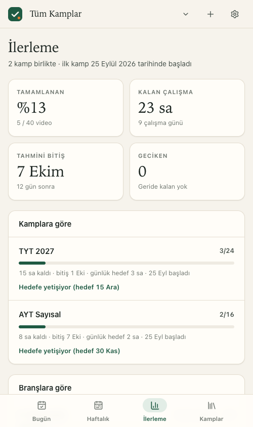

# Yetiştiricem

**[Canlı uygulamayı aç →](https://yetistiricem.pages.dev)**

**Ders videolarını çalışma ritmine göre günlere yerleştir; bugün ne çalışacağını ve hedefe ne kadar yaklaştığını tek yerden gör.**

Yetiştiricem, video listeleriyle çalıştığın öğrenme hedeflerini esnek çalışma kamplarına dönüştürür. TYT ve AYT hazırlığı bunun yalnızca iki örneği; dil öğrenimi, sertifika hazırlığı, mesleki gelişim veya kendi belirlediğin başka bir konu için de kamp oluşturabilirsin. Kampını branşlara ayırabilir, çalışma ritmini seçebilir ve ilerlemeni Bugün, Haftalık ve İlerleme ekranlarında takip edebilirsin.

  

  

  
  

Ekran görüntülerinde bağlantısız örnek plan verileri kullanılmıştır.

## Neler yapabilirsin?

- **Bir kamp oluştur:** Kampına ad ver, başlangıç ve istersen hedef bitiş tarihini seç.
- **Branşlarını ekle:** YouTube oynatma listesi ekleyebilir, videoları tek tek girebilir ya da bir liste yapıştırabilirsin. Her oynatma listesi kendi branşı olur.
- **Kendi ritmini belirle:** Videoları çalışma günlerine otomatik dağıt veya hangi gün hangi branşı çalışacağını kendin seç. Dinlenme ve deneme günlerini de plana kat.
- **Birden fazla hedefi birlikte takip et:** Farklı konulardaki kampları ayrı tempolarda sürdür; Bugün ve Haftalık ekranlarında görevlerini birleşik gör ya da tek kampa odaklan.
- **Günlük ilerlemene bak:** Tamamladığın videoları işaretle; kalan süreyi, haftalık yükü ve tahmini bitiş tarihini izle.
- **Planı gerektiğinde ileri taşı:** Bir görevi tamamlamak planını değiştirmez. Geride kaldığında kalan görevleri yalnızca sen istediğinde yeniden planla.
- **Planını yedekle:** Çalışma verilerin kullandığın tarayıcıda tutulur. Ayarlar’dan yedek indirip daha sonra geri yükleyebilirsin.

## Nasıl kullanılır?

1. Kaynak olarak oynatma listelerini, tek tek videoları veya yapıştırılmış bir video listesini ekle.
2. Kampının adını ve başlangıç tarihini belirle; hedef bitiş tarihi isteğe bağlıdır.
3. Otomatik dağıtımı veya branşları günlere kendin yerleştirmeyi seç.
4. Önizlemede programını gözden geçir ve her gün ilerlemeni işaretle.

## Belgeler

Kullanım ve ürün davranışı için [Ürün ve kullanım rehberi](docs/urun-rehberi.md); proje yapısı ve geliştirme için [teknik belgeler dizini](docs/README.md).
