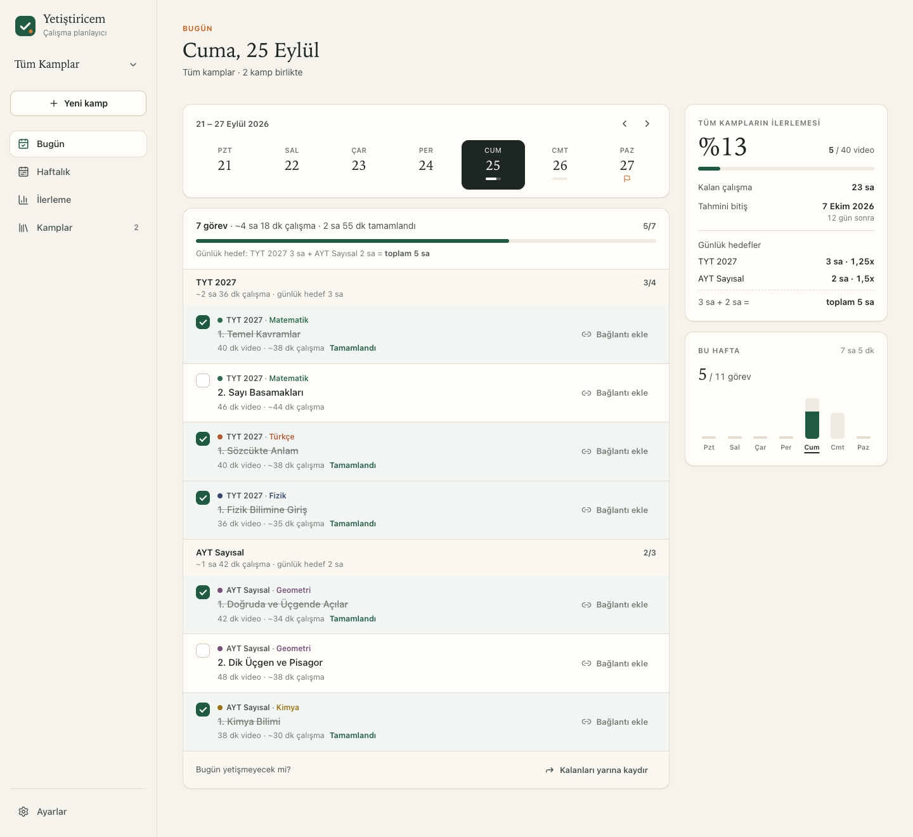
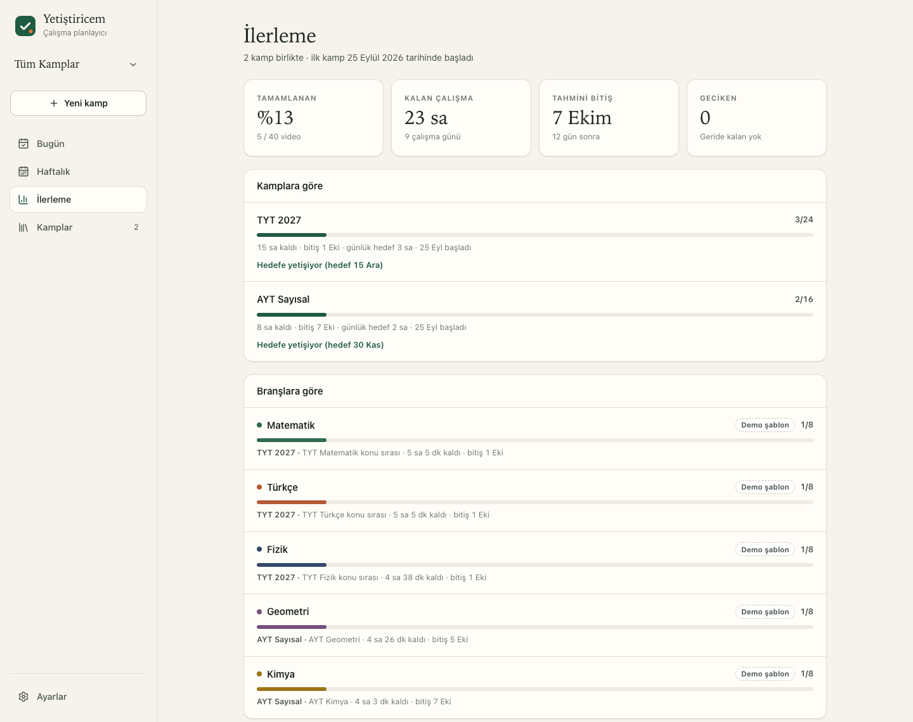

# Yetişir.

**Panik yok, yetişir.**

**[Canlı uygulamayı aç →](https://yetistiricem.pages.dev)**

Sınava, mülakata ya da yeni bir hedefe hazırlanan herkesin aklındaki soru aynı: *“Bu kadar video, bu saatten sonra yetişir mi?”* Yetişir bu soruya motivasyon cümlesiyle değil, takvimle cevap verir. YouTube oynatma listeni ekle, izleme hızını ve günlük süreni seç; motor her güne sığacak kadarını koyar ve hedefine hangi gün yetişeceğini gösterir. Bir gün aksarsan suçluluk yok: ritmini güncelle, kalanlar yeniden dağılır.

Yetişir, video listeleriyle çalıştığın öğrenme hedeflerini esnek çalışma kamplarına dönüştürür. TYT ve AYT hazırlığı bunun yalnızca iki örneği; dil öğrenimi, sertifika hazırlığı, mesleki gelişim veya kendi belirlediğin başka bir konu için de kamp oluşturabilirsin. Kampını branşlara ayırabilir, çalışma ritmini seçebilir ve ilerlemeni Rotam ve İlerleme ekranlarında takip edebilirsin.

  

  

Ekran görüntülerinde bağlantısız örnek plan verileri kullanılmıştır.

## Neler yapabilirsin?

- **Bir kamp oluştur:** Kampına ad ver, başlangıç ve istersen hedef bitiş tarihini seç.
- **Branşlarını ekle:** YouTube oynatma listesi ya da video bağlantıları ekleyebilirsin; başlık ve süreler YouTube’dan gelir. YouTube dışındaki dersleri konu ve süreyle elle yazabilirsin. Her oynatma listesi kendi branşı olur.
- **Kendi ritmini belirle:** Videoları çalışma günlerine otomatik dağıt veya hangi gün hangi branşı çalışacağını kendin seç. Dinlenme ve deneme günlerini de plana kat.
- **Birden fazla hedefi birlikte takip et:** Farklı konulardaki kampları ayrı tempolarda sürdür; Rotam ekranında görevlerini birleşik gör ya da tek kampa odaklan.
- **Günlük ilerlemene bak:** Tamamladığın videoları işaretle; kalan süreyi, haftalık yükü ve tahmini bitiş tarihini izle.
- **Suçluluksuz yeniden planla:** Bir görevi tamamlamak planını değiştirmez. Geride kaldığında “Ritmi güncelle” ile kalanları yalnızca sen istediğinde yeniden dağıt; neden aksadığını seçersen İlerleme ekranı alışkanlıklarını gösterir.
- **Planın hesabında:** Kampların, ilerlemen ve notların hesabına kaydedilir; giriş yaptığın her cihazda aynı plan açılır. Ayarlar’dan yedek indirip geri de yükleyebilirsin.
- **Yapay zekâyla çalış:** Claude, ChatGPT ya da Gemini’yi hesabına bağla; “nasıl gidiyorum?” diye sor, ilerlemeni okuyup değerlendirsin; roadmap’ini sohbette birlikte kurun, onayınla planına eklesin ([kurulum](docs/mcp.md)).

## Nasıl kullanılır?

1. Kaynak olarak oynatma listelerini, video bağlantılarını ya da elle yazdığın konuları ekle.
2. Kampının adını ve başlangıç tarihini belirle; hedef bitiş tarihi isteğe bağlıdır.
3. Otomatik dağıtımı veya branşları günlere kendin yerleştirmeyi seç.
4. Önizlemede programını gözden geçir ve her gün ilerlemeni işaretle.

## Belgeler

Kullanım ve ürün davranışı için [Ürün ve kullanım rehberi](docs/urun-rehberi.md); proje yapısı ve geliştirme için [teknik belgeler dizini](docs/README.md).
